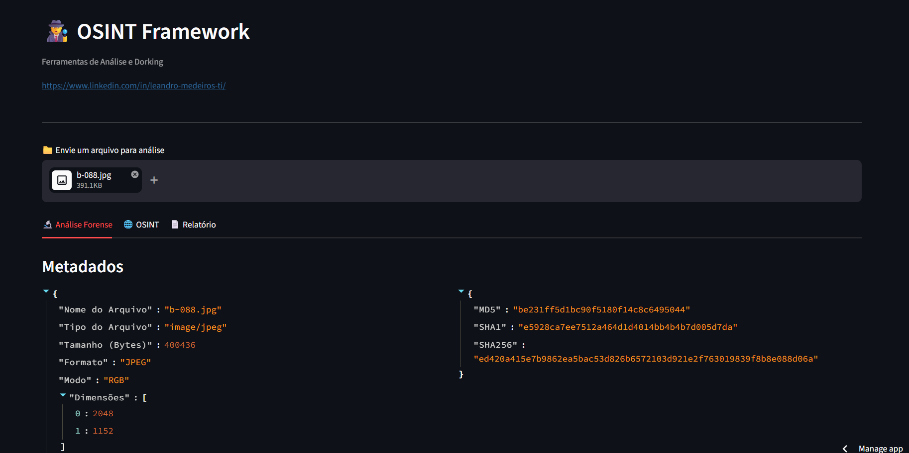
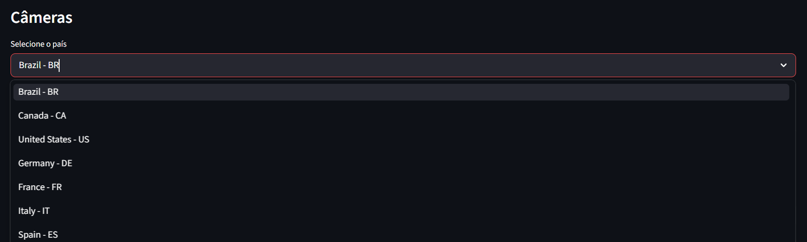

# 🕵️ OSINT Framework

Ferramenta para análise forense, Google Dorks e investigação de dados públicos.

## 🚀 Funcionalidades
- **Análise Forense**: Extrai metadados, GPS e hashes (MD5/SHA1/SHA256) de arquivos
- **Google Dorks**: Gera dorks organizados por categoria
- **Câmeras IP**: Acesso ao Insecam por país
- **Busca CNPJ**: Links para consulta em bases públicas
- **Relatórios**: Exporta em Markdown e PDF

  🛠️ Tecnologias
Streamlit | Pillow | ExifRead | fPdf | Markdown

---
**(Relatório com IA e outras análises de arquivo em desenvolvimento)**
